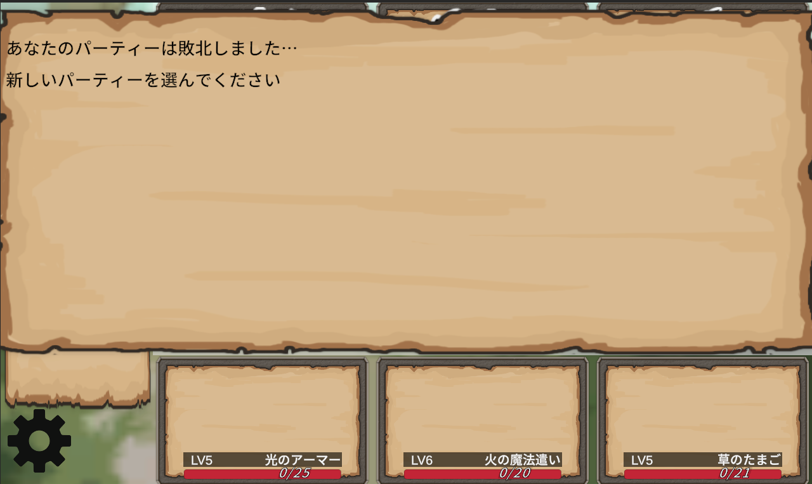

# DrawLineRPG
## プロジェクト概要
DrawLineRPGは訓練校の授業後の時間や休みの日の2ヶ月で個人制作したUnityゲームです。  
このゲームは、プレイヤーとNPCの3体のUnitがお互いにスキルを選択し、敵に向かって線を引きあいます。そしてバトルターンになったら線からボールが飛び出してきてボールが敵に当たったらスキルに応じたダメージを相手に与えることができます。
もしNPCを全員倒すことができれば経験値を得て、レベルアップすることができます。そうして強くなっていき最終ボスを撃破するのが目的のゲームです。


 
* 制作期間：2ヶ月
* 使用エンジン：Unity Editorバージョン 6000.0.54f1
* 使用言語：C#
* 使用アセット：  
キャラクター素材　→　nGardensoft様(Miniature Character Pack) ：UnityAssetStore  
UI素材 →　Black Hammer様(Fantasy Wooden GUI:Free) : UnityAsettStore  
背景:  
敵を選ぶ際の背景　→　ゲームまてりあるず様（ ギルド掲示板（3枚））  
https://game-materials.com/ギルド掲示板/  
戦闘シーンの背景　→　あおわを様（イラスト素材：背景イラスト02(昼の森-加工)）  
https://www.ac-illust.com/main/detail.php?id=2466922&word=背景イラスト02(昼の森-加工)     
音:  
タイトルシーンBGM　→　ユーフルカ様(【フィールド】果て無き旅路へ)  
https://youfulca.com/2022/08/11/field01/  
通常戦闘BGM　→　ユーフルカ様（【ステージ】Wild Road）  
https://youfulca.com/2022/08/13/stage_wild-road/  
ボス戦闘BGM　→　ユーフルカ様（【通常戦闘】レイピアを継ぐ少女）  
https://youfulca.com/2022/08/14/battle_rapier/  
線を引く音　→　ユーフルカ様（戦闘エフェクト）  
https://youfulca.com/2022/08/06/battle_sfx/  
戦闘開始の音、ダメージ音、回復音  →　ユーフルカ様（RPGツクールシステム効果音）  
https://youfulca.com/2022/08/06/rpgmaker_system/    
勝利音　→　ポケットサウンド様（【効果音】シンプルなファンファーレ「パンパカパーン」)  
https://pocket-se.info/archives/1339/  
クリック音　→　ポケットサウンド様（【効果音】決定音＃１６「高音のピッ」）  
https://pocket-se.info/archives/700/  

* Fontデータ： Noto Sans JP-Medium SDF (TMP_Font Asset)
* そのほかの使用ツール：GitHub、SorceTree、Visualstudio
  
## サンプルプレイ
ぜひゲームを体験してください！
(https://kaeru201.cheap.jp/)

## ゲームフロー
* #### タイトル


*  #### パーティー選択  
ボタンに対応したパーティーを選ぶことができます。違うパーティーで遊ぶことでまた違ったゲーム体験をすることができます。  


* #### 敵選択  
ボタンに対応した敵を選び、戦うことができます。自分のパーティーのレベルに近い敵を選ぶことで効率的にレベルアップをすることができます。    
最終的には下のLastBossを倒すことが目的となります。  


* #### バトルシーン　技選択  
自分のパーティーと敵を選び終わったらいよいよ戦いになります！
左から順番にプレイヤーのUnit行動選択から始まります（アイテム、にげるは未実装）
戦うを押すと、そのUnitが覚えている技が出てきます。その技を左クリックすると線を引くターンに移行します。  


* #### 線を引く  
線を引くターンになったら、現在行動しているUnitの前に白い点が出てきますので、そこから左クリックを長押しすると線を引くことができます。
長押ししている際に右クリックを押すとそこで線が止まり線の形が決定します。また、長押ししてる際に左クリック離すと最初から線を引きなおすことになります。  
選択した技の距離の値によって引ける線の長さが違います。序盤から強い技などは距離が短くなってしまっているため正面の敵や、ひとつ隣のUnitにしか線が届かないようになっています。  
その線は攻撃したいUnitの正面に配置してあるPointにたどり着くように線を引きましょう！味方のPointにも当たってしまうので注意！  

* #### 敵が線を引く  
そして味方の行動をすべて選択したら、敵も順番にこちらに向かって線を引いてきます！  
そのとき敵がどのスキルを選択しているかが左のダイヤログに流れています。攻略のヒントになります。  

* #### ボールを発射とダメージ  
お互い全員の線を引き終わったらすべての線からボールが発射されます。
ここでボールが誰かのPointにあたると、ボールを発射したUnitの攻撃力、レベル、スキルの攻撃力、当たった相手の防御力を参照してダメージを与えます。

* #### ボールとボールがぶつかる  
しかし、Pointにたどり着く前に敵のボールとぶつかることもあります。その場合はスキルの貫通力を参照して、貫通力が高いスキルのボールだけが残ります。
（貫通力が同じ場合はどちらも消える）その際、ダイヤログにメッセージがでます。攻撃力の高い技は貫通力が低く設定されている場合も多いので敵のボールに当たらないように線を引く工夫が必要になります!  

* #### 勝ち  
もし敵を全員倒すことができれば敵のレベルやHPを参照して経験値を得ることができます!
経験値が一定上がればレベルアップすることができます。LastBoss以外は何回でも対戦できますでの、これを繰り返してLastBossを倒しましょう!!  

* #### 負け  
もし味方が全滅してしまうと負けてしまいます。パーティー選択まで戻されてしまい、今まで稼いだ経験値もなくなってしまいます。
強い敵は経験値が多いですが、負けてしまうと無駄になってしまうので準備をしてから挑むことをオススメします!  
  
  
## ポートフォリオのスクリプト
#### 線を引くスクリプト
線を引くスクリプトは以下の要素を含み作成、調整しました。
* 線の引き始めはUnitのStartPointオブジェクトの範囲内から始めるように
* 左クリックを押し続けている間は線を引け、左クリックを離したら線を初期化するように
* 選択されたスキルに合わせて引ける距離を制限できるように
* マウスを動かすスピードによって線の引ける距離が変わってしまわないように
* 選択されたスキルに合わせて線の色を変えられるように

左クリックを押した時はRayCastの力を使ってStartPointだったら線を引くメソッドを発動するように
```C#
void Update()
{
 //マウスのスクリーン座標をワールド座標に変換する
 Vector3 mousePos = Camera.main.ScreenToWorldPoint(new Vector3(Input.mousePosition.x, Input.mousePosition.y, fixedDrawZ));

 if (Input.GetMouseButtonDown(0))
  {     
     //マウスを押した時にStartPointの中だったら
     Ray ray = Camera.main.ScreenPointToRay(Input.mousePosition);
     RaycastHit2D hit = Physics2D.Raycast((Vector2)ray.origin, (Vector2)ray.direction);

     if (hit.collider == null)return;

     else if (hit.collider.CompareTag("StartPoint"))//startPointだったら
     {
         AddLine(mousePos);//マウスの座標に点を置く                   
     }
  }
}
```
AddLineメソッドでLineRendererのPosCountの数値を1ずつ増やすことで2つの点で単純な直線な線ではなく複数の点で細かく曲げたりできる線を再現しました。
```C#
 //線を引くメソッド(点)
 void AddLine(Vector3 point)
 {
     point.z = fixedDrawZ;//z軸を固定
     lineRenderer.positionCount = posCount + 1;//繰り返す度に点を増やしていく
     lineRenderer.SetPosition(posCount, point);//一つ前の点から次の点に線を書く
     posCount++;
     lastAddPoint = point;
 }
```
distanceMouse変数でどれだけ前回の点からマウスが動いているかを確認して、それを活かしてif文で一定の距離の間をマウスが移動したときだけAddLineメソッドを発動するようにすることでマウスの動きのスピードによって線が変わりにくいようにしました。  
さらにlengthToAdd変数で前回の点からどれだけ移動したかを代入しておき、それをcurrentLineRangeに足していき、スキルのMaxLineRange以上になったら線を引けなくなるように再現しました。
```C#
 void Update()
{
 //左クリック押し続けている間かつisDrawがtrueなら
 if (Input.GetMouseButton(0) && isDrawing)
 {    
     //もし線を描ける最大距離に達したら
     if (currentLineRange >= MaxLineRange)
     {
        isDrawing = false;//線を描くのをやめる
        return;
     }

     //最後点と今のマウスの位置の差
     float distanceMouse = Vector2.Distance(lastAddPoint, mousePos);

     //もししきい値よりマウスが離れなかったら、かつしきい値よりマウスが離れたら
     if (distanceMouse <= 0.3f && distanceMouse >= 0.1f)
     {
                            
        Vector3 newPoint = mousePos; //新しい点をマウスの座標にして

        float lengthToAdd = Vector3.Distance(lastAddPoint, newPoint) * 0.25f;//あとどれくらい描けるかを取得する変数


        AddLine(newPoint);//点を追加する

        currentLineRange += lengthToAdd;
     }

 }
}

```
#### ダイヤログのスクリプト
ダイヤログはプレハブ化したTextをインスタンス化して、Textの内容を対応したものに変更するようにしました。  
さらにリストにdialogTextObjsインスタンス化したTextを覚えておいて、リストの要素番号にって場所を決めるようにし、
上限までダイヤログが追加されたら要素番号が0のTextを削除し、すべてのTextを一個上にずらしてから追加するように再現しました。
```C#

    //ダイヤログで表示するものが出るたびに他のクラスから呼ばれて、ダイヤログを更新するメソッド
    public void AddDialog(string dialog)
    {
      
        //まだListに要素がないなら次の出現地点を初期地点に
        if (dialogTextObjs.Count == 0) nextPosition = startPosition;

        //dialogTextの要素数がdialogLimit以上だったら
        if (dialogTextObjs.Count >= dialogLimit)
        {
            //要素数が1番上のオブジェクトごとテキストとListを削除して           
            Destroy(dialogTextObjs[0].gameObject);
            dialogTextObjs.RemoveAt(0);

            //残っているすべてListのオブジェクトを上にずらす
            foreach (TextMeshProUGUI textObj in dialogTextObjs)
            {
                Vector3 textPos = textObj.gameObject.transform.localPosition;

                textPos.y += dialogSpece;

                textObj.gameObject.transform.localPosition = textPos;
            }

            nextPosition.y += dialogSpece;//次の出現地点を上にずらす(枠から出ないように)

        }

        //ダイヤログテキストをインスタンス化
        TextMeshProUGUI text = Instantiate(prefabText);
        dialogTextObjs.Add(text);//dialogTextリストに追加
        text.transform.SetParent(transform);//親をこのオブジェクトに
        text.transform.localPosition = nextPosition;//出現地点
        text.transform.localScale = new Vector3(1, 1, 1);
        text.text = dialog;//テキストをメソッドの引数に変更

        nextPosition.y -= dialogSpece;//次の出現地点を下にずらす

    }
    
```
## ポートフォリオ制作にあたっての工夫
#### 授業外の勉強
今回が初めてプログラミングというものに触れた、かつ授業でまだC#を学んでいない時からこのポートフォリオの制作に手を付け始めま  
した。ですのでただ授業を受けていてもこのポートフォリオを制作することはできませんでした。そうでなくとも授業でやらないような  
機能の実装等もあり、自分で授業外の勉強をすることでこのポートフォリオを制作することができました。授業外の勉強では、検索で実  
装したいことを調べ、なぜそうなるのか、どう工夫したら自分のポートフォリオに落とし込めるかなどを考えました。さらに時にはわか  
らない部分をAIに聞いたりして実装しました。ただし、AIに頼りきるというよりちょっとしたわからない部分を検索する変わりにAIに頼  
り、検索する時間の短縮という使い道をしました。
#### できるだけ自分の構想通りに
ポートフォリオに制作していてどうしても構想した動きにならないときが多々ありました。妥協して簡単に実装できる動きにすることも  
できました。しかし、ゲームを作るからには妥協したゲームでは面白くならないと思い、出来る限り自分の構想通り、もっと言うなら面  
白くなるように妥協せずにどうしたら理想の挙動になるかを考えました。そのおかげでかなり理想に近い形で実装できたと思います。
#### 納期
実際の現場では納期が存在し、いつまでも制作しているわけにはいかないと思います。なので私も今回のポートフォリオには訓練校の授  
業が終わるまでには完成させるつもりでいました。そうしたことで作業にメリハリがつきモチベーションが尽きることなく制作に当たる  
こともできました。

## 今後の課題、展望
まだUnitを20体ほどしか実装していません。なのでいつかは100体ほど追加したいと思っています。さらに、現在はボタンを押すことで  
味方のUnitや敵のUnitを決定していますが、キャラクターを動かしてランダムエンカウントなどを実装して対戦できたらと考えており  
ます。
