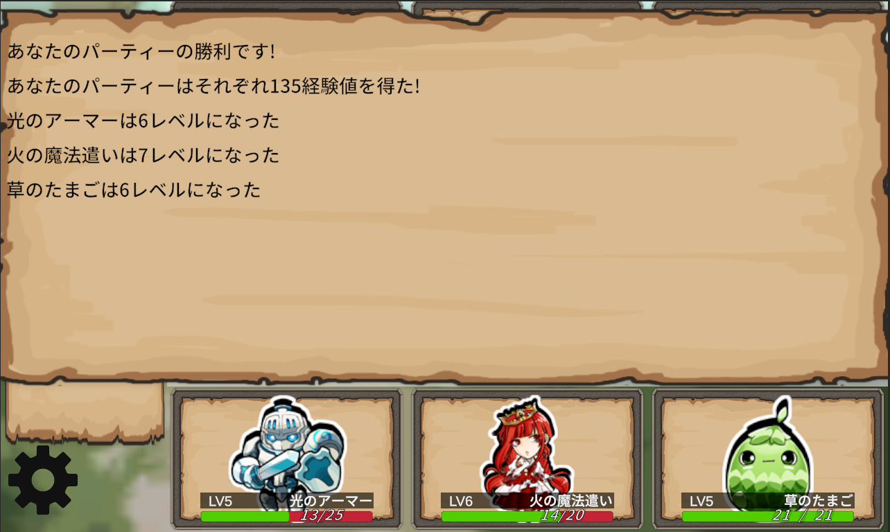

# DrawLineRPG
## プロジェクト概要
DrawLineRPGは訓練校の授業後の時間や休みの日の2ヶ月で個人制作したUnityゲームです。  
このゲームは、プレイヤーとNPCの3体のUnitがお互いにスキルを選択し、敵に向かって線を引きあいます。そしてバトルターンになったら線からボールが飛び出してきてボールが敵に当たったらスキルに応じたダメージを相手に与えることができます。
もしNPCを全員倒すことができれば経験値を得て、レベルアップすることができます。そうして強くなっていき最終ボスを撃破するのが目的のゲームです。

 
* 制作期間：2ヶ月
* 使用エンジン：Unity Editorバージョン 6000.0.54f1
* 使用言語：C#
* 使用アセット：  
キャラクター素材　→　nGardensoft様(Miniature Character Pack) ：UnityAssetStore  
UI素材 →　Black Hammer様(Fantasy Wooden GUI:Free) : UnityAsettStore  
背景:  
敵を選ぶ際の背景　→　ゲームまてりあるず様（ ギルド掲示板（3枚））  
https://game-materials.com/ギルド掲示板/  
戦闘シーンの背景　→　あおわを様（イラスト素材：背景イラスト02(昼の森-加工)）  
https://www.ac-illust.com/main/detail.php?id=2466922&word=背景イラスト02(昼の森-加工)     
音:  
タイトルシーンBGM　→　ユーフルカ様(【フィールド】果て無き旅路へ)  
https://youfulca.com/2022/08/11/field01/  
通常戦闘BGM　→　ユーフルカ様（【ステージ】Wild Road）  
https://youfulca.com/2022/08/13/stage_wild-road/  
ボス戦闘BGM　→　ユーフルカ様（【通常戦闘】レイピアを継ぐ少女）  
https://youfulca.com/2022/08/14/battle_rapier/  
線を引く音　→　ユーフルカ様（戦闘エフェクト）  
https://youfulca.com/2022/08/06/battle_sfx/  
戦闘開始の音、ダメージ音、回復音  →　ユーフルカ様（RPGツクールシステム効果音）  
https://youfulca.com/2022/08/06/rpgmaker_system/    
勝利音　→　ポケットサウンド様（【効果音】シンプルなファンファーレ「パンパカパーン」)  
https://pocket-se.info/archives/1339/  
クリック音　→　ポケットサウンド様（【効果音】決定音＃１６「高音のピッ」）  
https://pocket-se.info/archives/700/  

* Fontデータ： Noto Sans JP-Medium SDF (TMP_Font Asset)
* そのほかの使用ツール：GitHub、SorceTree、Visualstudio
  
## サンプルプレイ
ぜひゲームを体験してください！
//ゲーム画像（https://

## ゲームフロー
* タイトル

* パーティー選択  
ボタンに対応したパーティーを選ぶことができます。違うパーティーで遊ぶことでまた違ったゲーム体験をすることができます。

* 敵選択  
ボタンに対応した敵を選び、戦うことができます。自分のパーティーのレベルに近い敵を選ぶことで効率的にレベルアップをすることができます。    
最終的には下のLastBossを倒すことが目的となります。

* バトルシーン  
自分のパーティーと敵を選び終わったらいよいよ戦いになります！
左から順番にプレイヤーのUnit行動選択から始まります（アイテム、にげるは未実装）
戦うを押すと、そのUnitが覚えている技が出てきます。その技を左クリックすると線を引くターンに移行します。  

  
線を引くターンになったら、現在行動しているUnitの前に白い点が出てきますので、そこから左クリックを長押しすると線を引くことができます。
長押ししている際に右クリックを押すとそこで線が止まり線の形が決定します。また、長押ししてる際に左クリック離すと最初から線を引きなおすことになります。  
選択した技の距離の値によって引ける線の長さが違います。序盤から強い技などは距離が短くなってしまっているため正面の敵や、ひとつ隣のUnitにしか線が届かないようになっています。  
その線は攻撃したいUnitの正面に配置してあるPointにたどり着くように線を引きましょう！  味方のPointにも当たってしまうので注意！
  
そして味方の行動をすべて選択したら、敵も順番にこちらに向かって線を引いてきます！  
そのとき敵がどのスキルを選択しているかが左のダイヤログに流れています。攻略のヒントになります。  
  
お互い全員の線を引き終わったらすべての線からボールが発射されます。
ここでボールが誰かのPointにあたると、ボールを発射したUnitの攻撃力、レベル、スキルの攻撃力、当たった相手の防御力を参照してダメージを与えます。

しかし、Pointにたどり着く前に敵のボールとぶつかることもあります。その場合はスキルの貫通力を参照して、貫通力が高いスキルのボールだけが残ります。
（貫通力が同じ場合はどちらも消える）その際、ダイヤログにメッセージがでます。攻撃力の高い技は貫通力が低く設定されている場合も多いので敵のボールに当たらないように線を引く工夫が必要になります!

もし敵を全員倒すことができれば敵のレベルやHPを参照して経験値を得ることができます!
経験値が一定上がればレベルアップすることができます。LastBoss以外は何回でも対戦できますでの、これを繰り返してLastBossを倒しましょう!!

もし味方が全滅してしまうと負けてしまいます。パーティー選択まで戻されてしまい、今まで稼いだ経験値もなくなってしまいます。
強い敵は経験値が多いですが、負けてしまうと無駄になってしまうので準備をしてから挑むことをオススメします!

